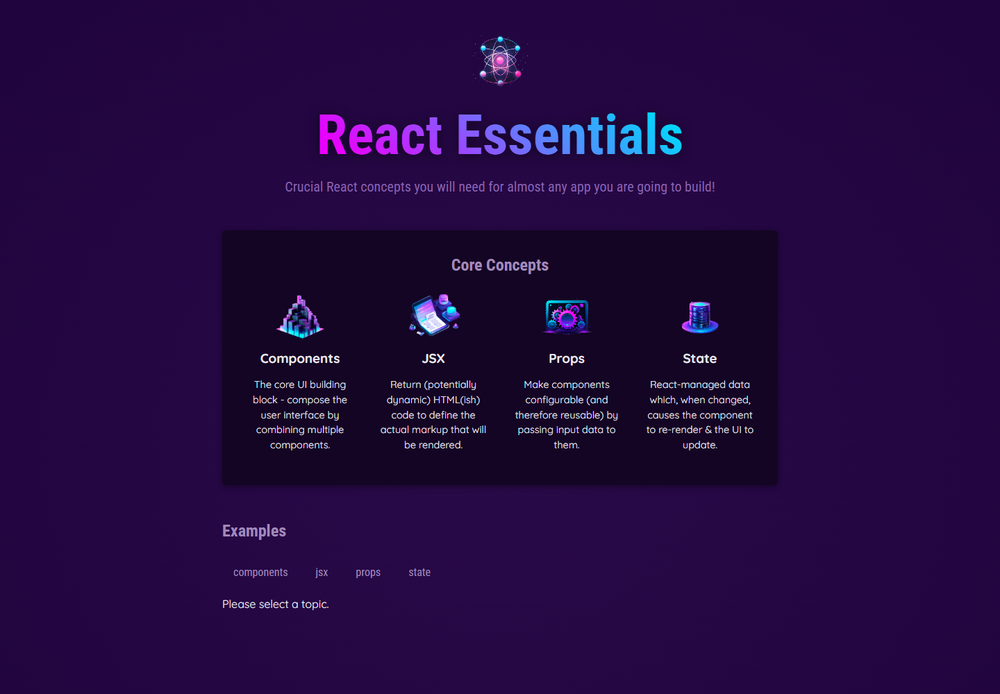
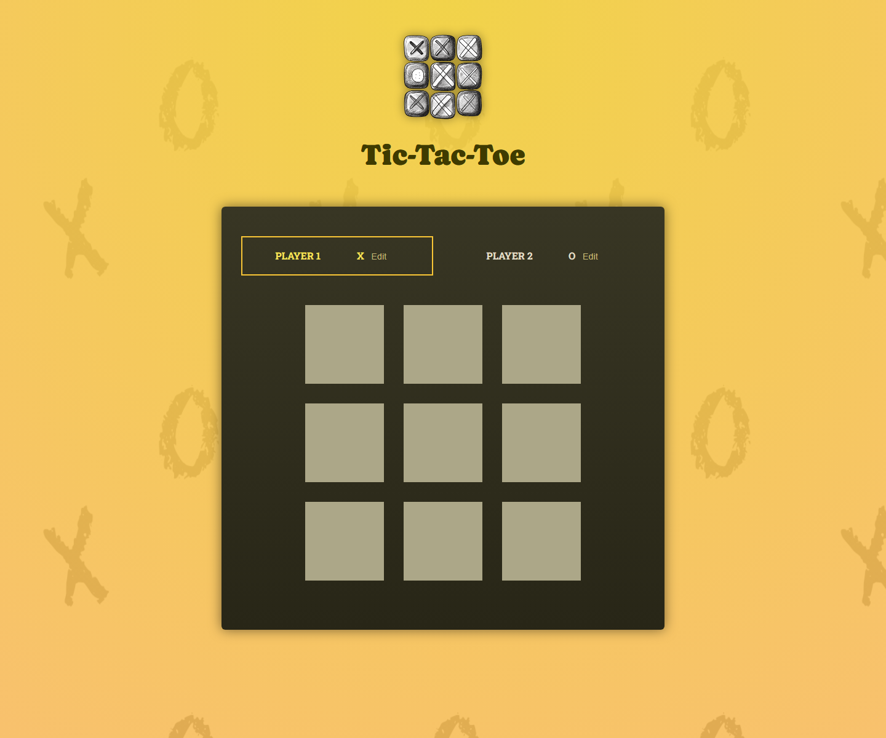

# React Learning Projects

This repository contains small projects built while learning React.

## Create the Project

```bash
npm create vite@latest react -- --template react
cd react
npm install
```

## Run the Project

```bash
npm run dev
```

## Project 1: React Essentials



## Project 2: Tic-Tac-Toe


